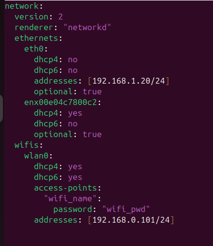
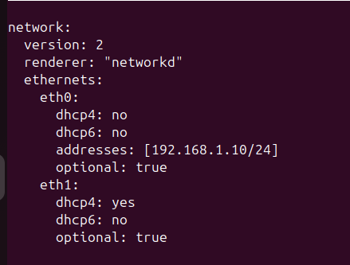

# 🐢 SmarTurtle Setup Guide

---

## 📦 Items Needed

1. TurtleBot3 with components + SD card 
2. Jetson Nano + SD card 
3. Ethernet access for Jetson Nano 
4. Ethernet cable to connect the Raspberry Pi with the Jetson Nano 

---

## 🐢 I. TurtleBot3 Setup

1. Follow the original [TurtleBot3 Quick Start Guide](https://emanual.robotis.com/docs/en/platform/turtlebot3/quick-start/)
2. Set a static IP address for the `eth0` port in the TurtleBot3 SBC:

    ```bash
    $ sudo nano /etc/netplan/50-cloud-init.yaml
    ```

    The file should be edited to this: 
    

    ```bash
    $ sudo netplan apply
    ```

---

## 🚀 II. Jetson Nano Setup

1. Follow the original [Jetson Nano Developer Kit Setup Guide](https://developer.nvidia.com/embedded/learn/get-started-jetson-nano-devkit)
2. Insert Ethernet cable for internet access
3. Prepare micromamba environment:

    ```bash
    $ micromamba create env --name robotenv python=3.12 torchvision=0.21.0
    ```
4. Install LeRobot dependencies:
    ```bash
    $ micromamba activate robotenv
    $ micromamba install av=15.0.0 -c conda-forge # else pip install's av install throws error of not being within venv
    $ micromamba install rerun-sdk=0.22.0 -c conda-forge
    $ pip install lerobot
    ```
5. Install ROS2 Jazzy dependencies (Based on the [Robostack tutorial](https://robostack.github.io/GettingStarted.html)):
    ```bash
    $ micromamba activate robotenv
    $ micromamba install -c conda-forge -c robostack-jazzy ros-jazzy-desktop
    $ micromamba install -c conda-forge compilers cmake pkg-config make ninja colcon-common-extensions catkin_tools rosdep
    ```
6. Edit `.bashrc`:

    ```bash
    $ echo 'micromamba activate robotenv' >> ~/.bashrc 
    $ echo 'export PYTHONPATH=/home/$USER/micromamba/envs/robotenv/lib/python3.12/site-packages # so that ROS2 recognises the LeRobot package' >> ~/.bashrc
    $ echo 'export ROS_DOMAIN_ID=30 # TURTLEBOT3' >> ~/.bashrc
    ```

7. Set static IP address for `eth0` port:

    - Disconnect the Ethernet cable from the built-in port of the Jetson Nano 
    - Edit the netplan config:

    ```bash
    $ sudo nano /etc/netplan/01-netcfg.yaml
    ```

    The file should be edited to this: 
    

    ```bash
    $ sudo netplan apply
    ```

    - Connect the Jetson Nano and the Raspberry Pi via an Ethernet cable.

    > ⚠️ **IMPORTANT:** 
    > You want to connect the Jetson Nano with the TurtleBot3's Raspberry Pi via `eth0`, which should be the **built-in** Ethernet ports of the devices. 
    > If an Ethernet-to-USB adapter is connected **during system boot**, it may get the static IP, preventing proper communication with the TurtleBot. 
    >
    > It is therefore **advised** to insert the USB adapter (for internet access) **after** booting both devices. 
    > From this point on, the Jetson Nano's internet access is handled via USB-to-Ethernet adapter **and/or**  USB Wi-Fi dongle
